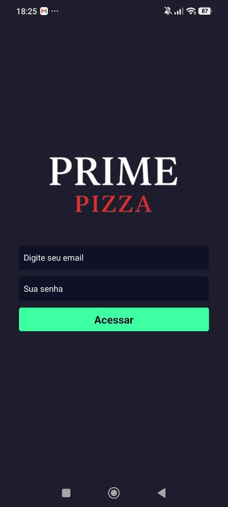
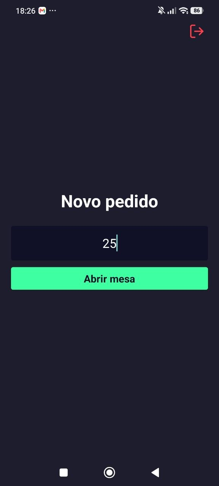
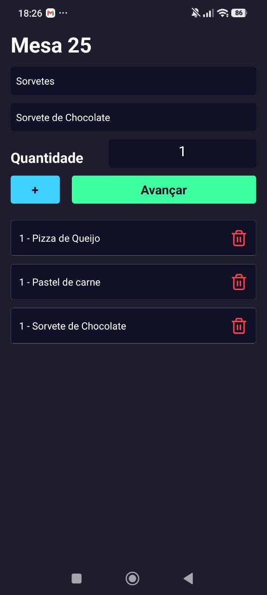
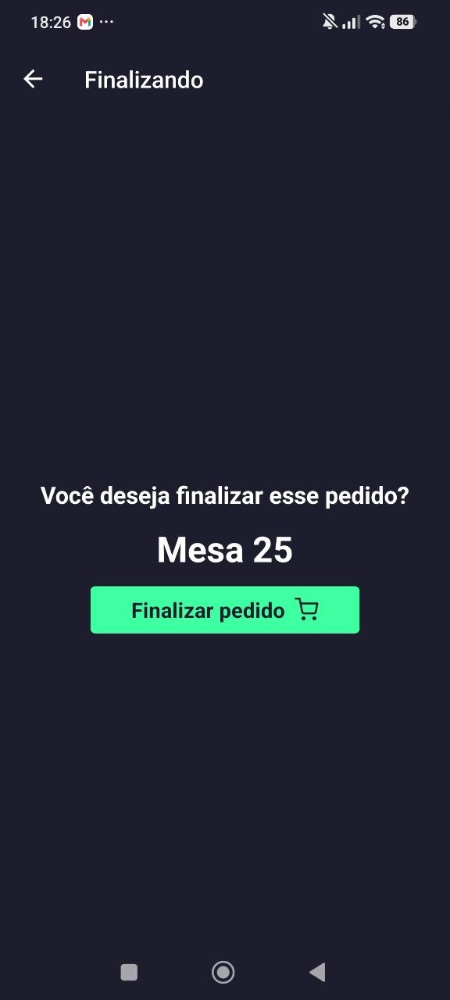

# 🍕 Prime Pizza - App Mobile (Garçom / PDV)

Interface mobile oficial da Prime Pizza, desenvolvida com **React Native** e **Expo**. O aplicativo foi projetado para o uso de garçons e atendentes, permitindo a abertura ágil de mesas, controle de comandas, filtro dinâmico de cardápio e finalização de pedidos diretamente pelo smartphone.

---

## 📸 Telas do Aplicativo


| Login | Abrir Mesa | Lançar Itens | Finalizar Pedido |
| :---: | :---: | :---: | :---: |
|  |  |  |  |

---

## 🚀 Tecnologias Utilizadas

Este projeto foi construído utilizando as melhores ferramentas do ecossistema mobile:

* **Framework:** React Native + Expo
* **Linguagem:** TypeScript
* **Roteamento:** React Navigation (Native Stack)
* **Consumo de API:** Axios (com Interceptors para tokens JWT)
* **Armazenamento Local:** AsyncStorage (Persistência de sessão)
* **Gerenciamento de Estado:** Context API e React Hooks
* **Estilização:** StyleSheet nativo e ícones Vector Icons (Feather)

---

## 📱 Funcionalidades

* **🔐 Autenticação Segura:** Login para funcionários com persistência de sessão via Token JWT.
* **📝 Controle de Mesas:** Abertura rápida de comandas baseada no número da mesa.
* **📋 Filtro Dinâmico:** Seleção inteligente de produtos filtrados instantaneamente por suas respectivas categorias (Pizzas, Bebidas, etc).
* **🛒 Gestão de Itens:** Adição de quantidades personalizadas e remoção de itens com atualização em tempo real.
* **✅ Finalização:** Integração direta com a API PrimePizza na Vercel para fechar a conta.

---

## ⚙️ Como Executar o Projeto

### Pré-requisitos
Você precisa ter o [Node.js](https://nodejs.org/) instalado em sua máquina e uma conta no [Expo](https://expo.dev/).

### Rodando em Modo de Desenvolvimento

1. **Clone o repositório:**
   ```bash
   git clone [https://github.com/PaulloMaggio/PrimepizzaReactNativeapk.git](https://github.com/PaulloMaggio/PrimepizzaReactNativeapk.git)
   cd PrimepizzaReactNativeapk
Instale as dependências:

Bash
npm install
Inicie o servidor de desenvolvimento:

Bash
npx expo start -c
Visualização:
Utilize o app Expo Go no seu celular físico (Android/iOS) e escaneie o QR Code gerado no terminal, ou pressione a para abrir no emulador Android.

📦 Como Gerar o APK (Android)
Para gerar o arquivo de produção .apk localmente para testes ou distribuição:

Gere os arquivos nativos do Android:

Bash
npx expo prebuild
Acesse a pasta do Android e rode o build via Gradle:

Bash
cd android
.\gradlew assembleRelease
O seu aplicativo compilado e otimizado estará disponível na pasta:
android/app/build/outputs/apk/release/app-release.apk

👤 Desenvolvedor
Paulo Maggio 🔗 LinkedIn: paulo-maggio-1738491a7

💻 GitHub: @PaulloMaggio